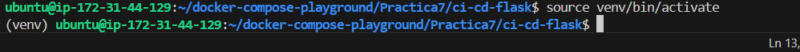
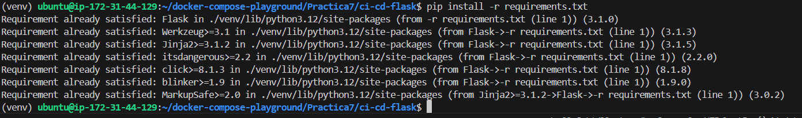
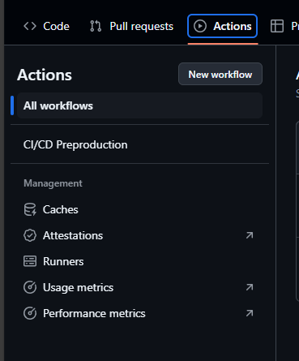
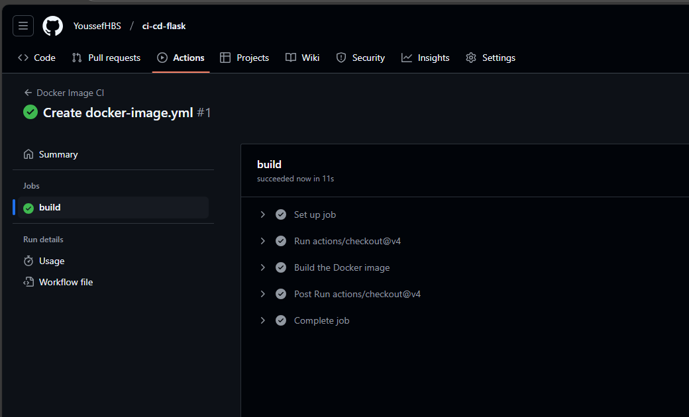

# ci-cd-flask

## Creamos un virtualenv en Python

```
python3 -m venv venv
```

Lo activamos.

```
source venv/bin/activate
```
Asi tiene que aparecer



Instalamos las dependencias que estas en `requirements.txt`.

```
pip install -r requirements.txt
```
Asi tiene que aparecer



Para desactivar el entorno.

```
deactivate
```

## Hacemos el Test

En nuestro repositorio de `GitHub`, en la opción actions, le damos en `New workflow` para hacer el test.




### build 
Y asi debería de salir  con el check en verde para tenerlo bien.


